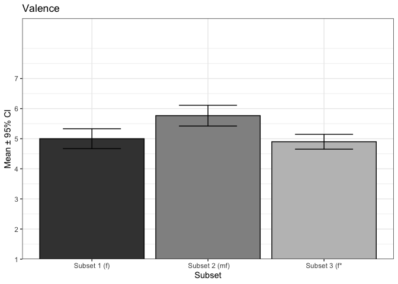

<!-- README.md is generated from README.Rmd. Please edit that file -->

# timbre2012

This repository contains data related to study

Eerola, T., Ferrer, R., & Alluri, V. (2012). Timbre and affect
dimensions: Evidence from affect and similarity ratings and acoustic
correlates of isolated instrument sounds. *Music Perception, 30(1)*,
49-70. <https://doi.org/10.1525/mp.2012.30.1.49>

The data was collected many moons ago and analysed with Matlab. I’ve
tried to export the summary data to CSV files to be more accessible to
others. In Experiment 3, the archived data in my backup does not match
the N reported in the paper (I have 24, paper reports 27). This could be
down trimming outliers differently or not saving the full data by the
first author.

The study is organised into three experiments:

-   **Experiment 1** is about rating 110 short instrument sounds from
    MUMS in terms of affects
-   **Experiment 2** is a subset of the Experiment 2 sounds that were
    rated without hearing the sounds (imagery condition)
-   **Experiment 3** is a set of 105 sounds from VSL that have various
    dynamic and timbral alterations. These were rated in the same way as
    Experiment 1.

The data is kept in the `data` folder of this repository as csv files.

# Experiment 1

`exp1_mean_ratings.csv` contains the mean ratings of several concepts of
110 sounds from 29 participants. In this data, `nro` is runnning number
for each instrument (links with audio files), the ratings have been done
on a scale of 1 to 9. The `instrument` columns gives the name of the
instrument.

``` r
d1 <- read.csv('data/exp1_mean_ratings.csv')
knitr::kable(d1[1:4,],digits = 2)
```

| nro | valence | energy | tension | preference | intensity | instrument             |
|----:|--------:|-------:|--------:|-----------:|----------:|:-----------------------|
|   1 |    4.83 |   6.28 |    6.31 |       5.10 |      5.31 | Accordion Treble Notes |
|   2 |    2.72 |   6.79 |    7.38 |       2.93 |      4.41 | Cornet                 |
|   3 |    5.34 |   4.93 |    4.97 |       5.28 |      4.17 | French Horn            |
|   4 |    4.31 |   6.00 |    5.90 |       4.59 |      5.00 | French Horn            |

``` r
knitr::kable(cor(d1[,2:5]),digits = 2,
             caption = 'Table 1 Correlations Between the Affect Ratings (from paper, p. 52).')
```

|            | valence | energy | tension | preference |
|:-----------|--------:|-------:|--------:|-----------:|
| valence    |    1.00 |  -0.59 |   -0.88 |       0.97 |
| energy     |   -0.59 |   1.00 |    0.84 |      -0.52 |
| tension    |   -0.88 |   0.84 |    1.00 |      -0.81 |
| preference |    0.97 |  -0.52 |   -0.81 |       1.00 |

Table 1 Correlations Between the Affect Ratings (from paper, p. 52).

The audio files are available at `exp1.zip`, which contains wave files
numbered from `1.wav .... 110.wav`, which have been originally obtained
from MUMS (McGill University Musical Instruments).

# Experiment 2

`mds_rotated.csv` contains the rotated solution from the mean similarity
ratings of 18 most popular instruments 13 participants.

``` r
d2 <- read.csv('data/mds_rotated.csv')
knitr::kable(d2[1:4,],digits = 2)
```

|  dim1 |  dim2 | names             |
|------:|------:|:------------------|
| -0.52 | -0.82 | Trumpet (w. mute) |
| -0.12 | -1.23 | Trombone          |
|  0.32 | -1.16 | Bassoon           |
|  0.05 | -1.14 | Cornett           |

``` r
library(ggrepel)
g2<-ggplot(d2,aes(x=dim1,y=dim2,label=names))+
  geom_point()+
  geom_label_repel(min.segment.length = 0.2)+
  coord_fixed()+
  theme_bw()
g2
```

<div class="figure">


<p class="caption">
Figure 3. MDS solution (from p. 56)
</p>

</div>

# Experiment 3

`exp3_mean_ratings.csv` contains mean ratings of several concepts of 105
sounds from 24 participants. <span style="color:red">NOTE: Data in my
archives has only 24 participants while the paper reports 27. There will
be minor discrepancies in the correlations due to this. </span>

These 105 sounds are divided into subsets and articulations. The ratings
have been done on a scale of 1 to 9. `subset` refers to subset 1, 2 or 3
(1 = “Forte”, 2 = “Mezzo Forte”, 3 = “Brightness Increase”) that contain
the timbre manipulation of the sounds.

`articulation` refers playing style (Plain, Legato, Vibrato, Pizzicato,
Staccato, Sforzato, Marcato) and `instruments` is a label for the actual
instrument (Bassoon, Cello, Clarinet, Flute, Horn, Marimba, Oboe, Oboe
Solo, Trombone, Trumpet, Vibraphone, or Violin).

``` r
d3 <- read.csv('data/exp3_mean_ratings.csv')
d3$subset <- factor(d3$subset,levels = c(1,2,3),labels = c("Subset 1 (f)", " Subset 2 (mf)","Subset 3 (f*"))
knitr::kable(d3[1:4,],digits = 2)
```

| trial | valence | energy | tension | preference | intensity | subset        | articulation | instruments |
|------:|--------:|-------:|--------:|-----------:|----------:|:--------------|:-------------|:------------|
|     1 |    5.17 |   4.46 |    4.33 |       4.96 |      3.38 | Subset 2 (mf) | Staccato     | Bassoon     |
|     2 |    4.88 |   5.50 |    4.54 |       4.71 |      3.83 | Subset 1 (f)  | Staccato     | Bassoon     |
|     3 |    6.33 |   3.75 |    4.12 |       5.38 |      4.62 | Subset 2 (mf) | Vibrato      | Oboe Solo   |
|     4 |    5.33 |   5.42 |    5.62 |       5.08 |      5.58 | Subset 1 (f)  | Vibrato      | Oboe Solo   |

### Data check

``` r
knitr::kable(cor(d3[,2:5]),digits = 2,caption = 'Table 5 Correlations Between the Affect Ratings (from paper, p. 59).')
```

|            | valence | energy | tension | preference |
|:-----------|--------:|-------:|--------:|-----------:|
| valence    |    1.00 |  -0.50 |   -0.67 |       0.93 |
| energy     |   -0.50 |   1.00 |    0.86 |      -0.27 |
| tension    |   -0.67 |   0.86 |    1.00 |      -0.52 |
| preference |    0.93 |  -0.27 |   -0.52 |       1.00 |

Table 5 Correlations Between the Affect Ratings (from paper, p. 59).

``` r
library(tidyr)
library(ggplot2)
library(dplyr)
library(Hmisc)

g1 <- d3 %>% 
  group_by(articulation) %>%
  summarise(mean= mean(valence),ci = mean_cl_normal(valence)) %>% 
  ggplot(aes(x = articulation,y = mean,fill=articulation))+
  geom_col(colour='black',show.legend = FALSE)+
  scale_y_continuous(breaks = seq(1,7,by=1), expand = c(0,0))+
  geom_errorbar(aes(ymin=ci$ymin,ymax=ci$ymax),width=0.5)+
  scale_fill_grey(start=.25,end=.75)+
  coord_cartesian(ylim = c(1, 9)) +
  ggtitle('Valence')+
  ylab('Mean ± 95% CI')+
  xlab('Articulation')+
  theme_bw()
print(g1)
```

<div class="figure">


<p class="caption">
Figure 6 mean ratings across articulation styles (p. 60)
</p>

</div>

``` r

g2 <- d3 %>% 
  group_by(subset) %>%
  summarise(mean= mean(valence),ci = mean_cl_normal(valence)) %>% 
  ggplot(aes(x = subset,y = mean,fill=subset))+
  geom_col(colour='black',show.legend = FALSE)+
  scale_y_continuous(breaks = seq(1,7,by=1), expand = c(0,0))+
  geom_errorbar(aes(ymin=ci$ymin,ymax=ci$ymax),width=0.5)+
  scale_fill_grey(start=.25,end=.75)+
  coord_cartesian(ylim = c(1, 9)) +
  ggtitle('Valence')+
  ylab('Mean ± 95% CI')+
  xlab('Subset')+
  theme_bw()
print(g2)
```

<div class="figure">


<p class="caption">
Figure 5 mean ratings across the three subsets (p. 60)
</p>

</div>

The soundfiles are available in `exp3.zip`, which contains wave files
numbered from`1.wav .... 105.wav`. These sounds are from VSL Kontakt
Orchestra (the *F*<sub>0</sub> is always D\#).

### Acoustic features

Extraction of the acoustic features should be redone from the audio
files as the toolboxes have moved on. I believe the acoustic features
were extracted with *MIR Toolbox version 1.2.4* in 2011.
